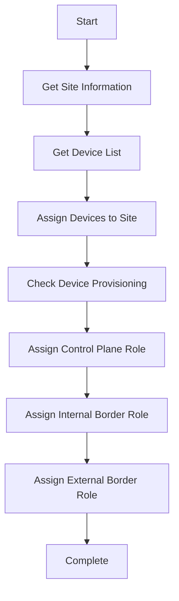

# DNA Center Automation Scripts

A comprehensive collection of Python scripts for automating Cisco DNA Center operations including device management, site creation, and SDA fabric configuration.

## 🚀 Repository Overview

This repository contains automation scripts for:
- **Device Management**: Adding devices, assigning to sites, provisioning
- **Site Management**: Creating buildings, areas, and floors
- **SDA Fabric**: Creating fabrics and assigning device roles
- **Credentials**: Managing CLI, SNMP, and NETCONF credentials

## 📁 Project Structure

```
DNA Center automation/
├── assign_device_roles_simple.py      # Main device role assignment script
├── assign_specific_device_roles.py    # Full-featured role assignment
├── device_roles_guide.py              # Step-by-step guide
├── assign_device_roles_demo.py        # Demo version
├── create_building.py                 # Building creation script
├── assign_devices_to_building.py      # Device assignment to buildings
├── requirements.txt                   # Python dependencies
└── README.md                          # This file
```

## 🛠️ Prerequisites

1. **Python 3.9+**
2. **Cisco DNA Center** (tested with version 2.3.7.9+)
3. **Required Python packages**:
   ```bash
   pip install -r requirements.txt
   ```

## 🔧 Installation

1. **Clone the repository**:
   ```bash
   git clone https://github.com/alphauser9850/dnac-automation.git
   cd dnac-automation
   ```

2. **Install dependencies**:
   ```bash
   pip install -r requirements.txt
   ```

3. **Configure DNA Center connection**:
   Update the connection details in each script:
   ```python
   dnac = CatalystCenterAPI(
       base_url="https://your-dnac-ip",
       username="your-username",
       password="your-password",
       verify=False
   )
   ```

## 📋 Scripts Overview

### 🎯 Device Role Assignment

| Script | Purpose | Status |
|--------|---------|--------|
| `assign_device_roles_simple.py` | **RECOMMENDED** - Simple device role assignment | ✅ Production Ready |
| `assign_specific_device_roles.py` | Full-featured role assignment with all steps | ✅ Production Ready |
| `device_roles_guide.py` | Step-by-step guide with API calls | 📚 Documentation |
| `assign_device_roles_demo.py` | Demo version showing API calls | 🎮 Demo |

### 🏗️ Site Management

| Script | Purpose | Status |
|--------|---------|--------|
| `create_building.py` | Create buildings in DNA Center | ✅ Production Ready |
| `assign_devices_to_building.py` | Assign devices to buildings | ✅ Production Ready |

## 🚀 Quick Start

### 1. Assign Device Roles

```bash
# Run the main device role assignment script
python assign_device_roles_simple.py

# Follow the prompts:
# Enter site name: BLDG-1
```

**Expected Output**:
- FB-1 (10.10.47.10): External Border Node
- FB-2 (10.10.47.20): Control Plane + Internal Border Node

### 2. Create a Building

```bash
# Create a new building
python create_building.py
```

### 3. Assign Devices to Building

```bash
# Assign devices to a building
python assign_devices_to_building.py
```

## 🔍 Key Features

### ✅ **Robust Error Handling**
- Handles "already provisioned" scenarios
- Manages "already assigned" device roles
- Provides clear error messages and guidance

### ✅ **Prerequisites Management**
- Automatic device-to-site assignment
- Device provisioning checks
- External ASN configuration guidance

### ✅ **Multiple Script Versions**
- Simple version for production use
- Full-featured version with all options
- Demo version for learning
- Guide version for step-by-step execution

## 📊 Device Role Assignment Workflow



## 🎯 Supported Device Roles

| Role | Device | API Method | Status |
|------|--------|------------|--------|
| **Control Plane** | FB-2 | `add_control_plane_device()` | ✅ Working |
| **Internal Border** | FB-2 | `adds_border_device()` | ✅ Working |
| **External Border** | FB-1 | `adds_border_device()` | ⚠️ Requires ASN config |

## 🔧 Configuration Requirements

### External Border Prerequisites
For External Border devices, you need to configure:

1. **External ASN** in DNA Center
2. **IP Transit** for the external ASN
3. **External Connectivity Settings**

**Steps**:
1. Go to DNA Center Web UI
2. Navigate to: Design → Network Settings → External Connectivity
3. Configure external ASN (e.g., 65002)
4. Set up IP Transit for the external ASN

## 🐛 Troubleshooting

### Common Issues

1. **"Device not provisioned"**
   - Solution: Run device provisioning first
   - Script handles this automatically

2. **"External Border requires ASN config"**
   - Solution: Configure external ASN in DNA Center
   - Follow the prerequisites guide

3. **"Already has fabric role assigned"**
   - This is normal - device already configured
   - Script skips gracefully

## 📚 API Reference

### Key API Methods Used

```python
# Device Management
dnac.devices.get_device_list()
dnac.sites.assign_devices_to_site()

# Device Provisioning
dnac.sda.provision_wired_device()

# Device Roles
dnac.sda.add_control_plane_device()
dnac.sda.adds_border_device()

# Site Management
dnac.sites.create_site()
dnac.sites.get_site()
```

## 🤝 Contributing

1. Fork the repository
2. Create a feature branch
3. Make your changes
4. Test thoroughly
5. Submit a pull request

## 📄 License

This project is licensed under the MIT License - see the LICENSE file for details.

## 👨‍💻 Author

**alphauser9850**
- GitHub: [@alphauser9850](https://github.com/alphauser9850)

## 🙏 Acknowledgments

- Cisco Catalyst Center SDK
- DNA Center API Documentation
- Community contributions and feedback

---

## 📞 Support

If you encounter any issues or have questions:

1. Check the troubleshooting section
2. Review the script output for error messages
3. Ensure DNA Center prerequisites are met
4. Open an issue on GitHub

**Happy Automating! 🚀**